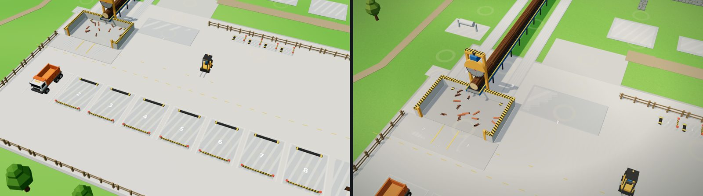
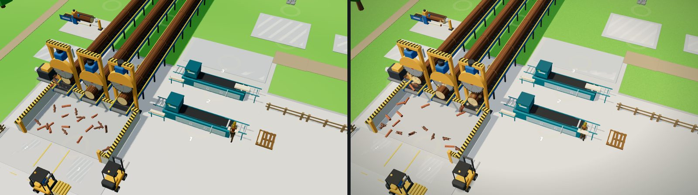
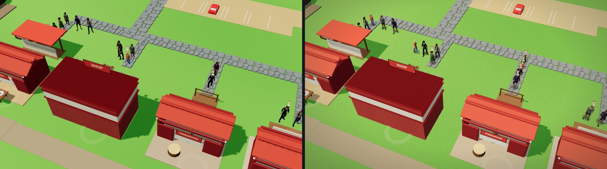
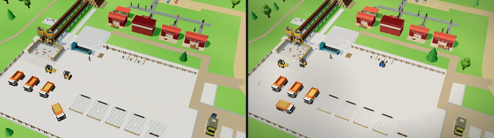

# Pilana Tajkun — izveštaj 2026-10-09 (faze A–D)

Šta je promenjeno u jednom danu rada i koliko je igra bolja. Merenja: Intel Arrow Lake iGPU, Chrome, 1280×800, Fast 4G (9 Mbit/s, 150 ms).

## Ukratko

- Igra se otvara **8× brže** (24,3 s → 2,9 s na 4G) i skida **8× manje** (25,7 → 3,1 MB).
- Kasna igra drži **~60 FPS** umesto 40, bez stalnog trzanja.
- Nema više izgubljenih klikova na „kupi“, scena izgleda toplije i „prizemljeno“, kupovina i zarada imaju animacije i zvuk.
- 47 automatskih testova (Playwright), dokumentacija i alati za agente (Claude + Cursor).

## Pre / posle

| Metrika | Pre | Posle | Promena |
|---|---|---|---|
| Do igre, Fast 4G | 24,3 s | 2,9 s | −88 % |
| Preuzimanje | 25,7 MB (blokira start) | 3,1 MB | −88 % |
| Modeli spremni, 4G | 25,6 s | 5,7 s | −78 % |
| FPS kasno (avg) | 40,1 | 58,8 | +47 % |
| p95 frejm kasno | 40,8 ms | 16,8 ms | −59 % |
| Frejmovi > 20 ms / 8 s | 144 | ~10 | −93 % |
| Draw call-ovi rano / kasno | 644 / 2 096 | ~240 / 835 | −63 % / −60 % |
| JS heap | 133 MB | 59 MB | −56 % |
| Klikovi „kupi“ koji prođu | 5 / 12 | 12 / 12 | 100 % |
| Automatski testovi | 0 | 47 | |

```mermaid
xychart-beta
  title "Učitavanje na Fast 4G (s)"
  x-axis ["Do igre", "Modeli spremni"]
  y-axis "sekunde" 0 --> 26
  bar [24.3, 25.6]
  bar [2.9, 5.7]
```

```mermaid
xychart-beta
  title "Kasna igra: FPS (veće je bolje)"
  x-axis ["Prosek", "1% low"]
  y-axis "FPS" 0 --> 60
  bar [40.1, 18.5]
  bar [58.8, 20.4]
```

```mermaid
xychart-beta
  title "Draw call-ovi (manje je bolje)"
  x-axis ["Rano", "Kasno"]
  y-axis "draw call-ovi" 0 --> 2200
  bar [644, 2096]
  bar [240, 835]
```

(prva traka = pre, druga = posle)

## Izgled: staro (levo) / novo (desno)

## Šta je urađeno

### Performanse i učitavanje
- Three.js iz `shared/vendor/` preko importmap-a (keš za sve igre); obrisan bundle od 25 MB i 11 MB nekorišćenih modela.
- Modeli kompresovani (meshopt + WebP): 17 → 2,6 MB; skript `tools/optimize-glb.mjs`, originali u `art/`.
- Spajanje statične geometrije (`bakeStatic`), instanciranje, točak kao jedan mesh, culling likova van kadra.
- Adaptivni kvalitet (Auto/High/Low, DPR), pauza ne crta, traka učitavanja, modeli „iskoče“ umesto da se zamene.

### Izgled
- Toplo sunce + PMREM okruženje, kontakt senke ispod vozila i ljudi, senke oblaka.
- Meke čestice (piljevina, prašina, dim, lišće) — jedan draw call za sve.
- Zgrade „izrastu“ uz prašinu; prelet kamere pri prvom startu; credits ekran.

### Animacije i osećaj
- Novac broji naviše, novčići lete do HUD-a, panel se ne gradi iznova (bez gubljenja klikova).
- Kamioni: kočiona svetla, ugib pri utovaru; drvo pada sa ubrzanjem; kamera klizi do tapnute mašine.
- Audio bus sa kompresorom, ambijent (vetar, ptice), slojevit zvuk kupovine, vibracija na telefonu.

### Zajednički kod (za sve igre)
`shared/gameroom-three.js`, `shared/gameroom-fx.js`, `shared/gameroom-audio.js`, `shared/vendor/three-0.170.0/`.

### Kvalitet i alati
- `tests/` — Playwright, 47 testova (smoke, kupovina, save, pauza, kamera, ekonomija, mobilni, performanse).
- `docs/` — playbook za agente, standard kvaliteta, performanse, testiranje, praćenje; po igri BUGS / TECH-DEBT / IMPROVEMENTS / TRACKER / LEDGER.
- Skill `game-audit`, benchmark preko http-a, Cursor pravila.

## Šta ostaje

- „Wow“ plan V1–V5 ([TRACKER](TRACKER.md)): novi modeli mašina, dan/noć + bloom, živ teren, herojski kadrovi, novi UI i prvih 30 s.
- PT-TD-020 trzaji pri prvom crtanju nove zgrade; PT-BUG-023 tamni likovi.
- Monetizacija, Faza 0 (SDK, analitika, engleski) — čeka posle V1–V2.
